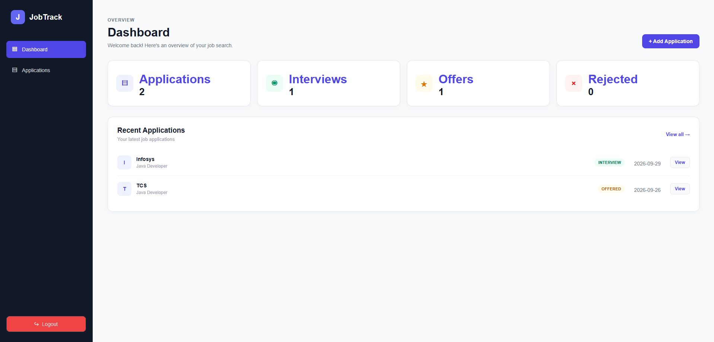
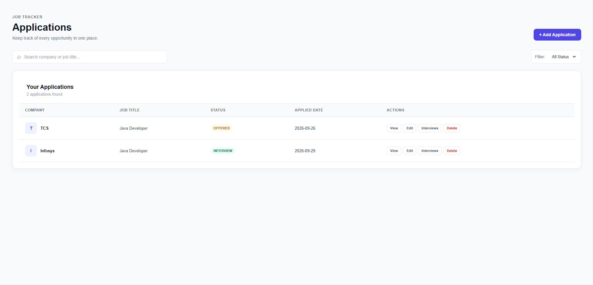
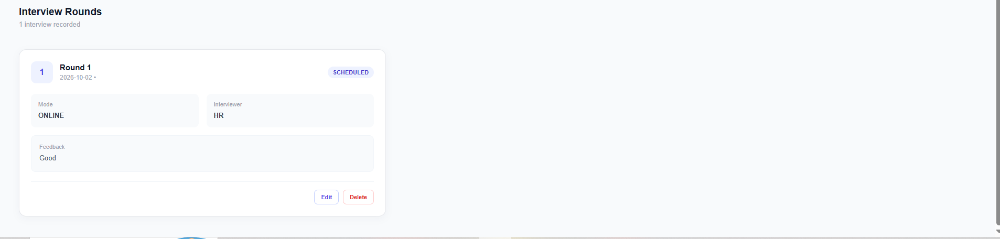

# JobTrack — Job Application & Interview Management System

JobTrack is a modern full-stack web application for managing job applications and interview rounds in one place.

It provides a clean dashboard where users can track applications, monitor interview rounds, update application details, and manage their job search.

## 🚀 Live Demo

**Frontend:**  
https://jobtrack-frontend-nine.vercel.app

**Backend:**  
https://jobtrack-backend-to3h.onrender.com

## ✨ Features

- User registration and login
- JWT-based authentication
- BCrypt password hashing
- Protected routes
- Dashboard with application statistics
- View all job applications
- Search applications by company or job title
- Filter applications by application status
- Add new job applications
- Edit existing applications
- Delete applications
- View detailed application information
- Manage interview rounds
- Add, edit, and delete interviews
- Track interview date and time
- Track interview mode and status
- Store interviewer information
- Add interview feedback
- User-specific application and interview data
- Logout functionality
- Responsive and modern UI

## 🛠️ Tech Stack

### Frontend

- React.js
- JavaScript
- React Router
- Axios
- HTML5
- CSS3
- Vite

### Backend

- Java
- Spring Boot
- Spring MVC
- Spring Security
- JWT
- Spring Data JPA
- Hibernate
- Maven

### Database

- MySQL
- Aiven

### Deployment

- Vercel — Frontend
- Render — Backend
- Aiven — MySQL Database

### Tools

- Visual Studio Code
- Eclipse
- MySQL Workbench
- Postman
- Git
- GitHub

## 🔐 Security

- JWT-based authentication
- BCrypt password hashing
- Spring Security authentication
- Protected REST API endpoints
- JWT authentication filter
- User-specific authorization
- CORS configuration for production
- Environment-based configuration

## 🏗️ Application Architecture

```text
React Frontend
      ↓
     Axios
      ↓
Spring Boot REST API
      ↓
Spring Security + JWT
      ↓
Spring Data JPA / Hibernate
      ↓
Aiven MySQL
```

## Application Structure

```text
src/
├── Components/
│   ├── Dashboard.jsx
│   ├── Dashboard.css
│   ├── Applications.jsx
│   ├── Applications.css
│   ├── AddApplication.jsx
│   ├── AddApplication.css
│   ├── EditApplication.jsx
│   ├── ApplicationDetails.jsx
│   ├── ApplicationDetails.css
│   ├── Interviews.jsx
│   ├── Interviews.css
│   ├── Login.jsx
│   ├── Register.jsx
│   └── ProtectedRoute.jsx
│
├── services/
│   ├── api.js
│   └── apiClient.js
│
├── App.jsx
├── App.css
├── index.css
└── main.jsx
```

## 🎨 Styling

The frontend uses separate CSS files for individual pages and components to keep the styling organized and maintainable.

- `Dashboard.css` — Dashboard styling
- `Applications.css` — Applications list and search/filter UI
- `AddApplication.css` — Add and Edit Application forms
- `ApplicationDetails.css` — Application details page
- `Interviews.css` — Interview management page
- `App.css` — Shared application-level styles
- `index.css` — Global styles

## Screenshots

### Dashboard



### Applications



### Interviews



## ⚙️ Running Locally

### Prerequisites

Make sure you have the following installed:

- Node.js
- npm
- Git

### 1. Clone the repository

```bash
git clone https://github.com/Techy-nithin/jobtrack-frontend.git
```

### 2. Navigate to the project

```bash
cd jobtrack-frontend
```

### 3. Install dependencies

```bash
npm install
```

### 4. Configure environment variables

Create a `.env` file in the project root:

```env
VITE_API_BASE_URL=http://localhost:8080
```

> Do not commit `.env` to GitHub.

### 5. Start the development server

```bash
npm run dev
```

The application will run at:

http://localhost:5173

## 📦 Production Build

To create an optimized production build:

```bash
npm run build
```

The production files will be generated inside the `dist` directory.

## 🌐 Deployment

The frontend is deployed using Vercel.

The production frontend communicates with the Spring Boot backend deployed on Render.

```text
Vercel
   │
   │ HTTPS REST API
   ▼
Render
   │
   │ JDBC + SSL
   ▼
Aiven MySQL
```

### Production URLs

**Frontend:**  
https://jobtrack-frontend-nine.vercel.app

**Backend:**  
https://jobtrack-backend-to3h.onrender.com

## 🔗 Project Repositories

**Frontend:**  
https://github.com/Techy-nithin/jobtrack-frontend

**Backend:**  
https://github.com/Techy-nithin/jobtrack-backend

## 👨‍💻 Author

**G Nithin**

GitHub:  
https://github.com/Techy-nithin
